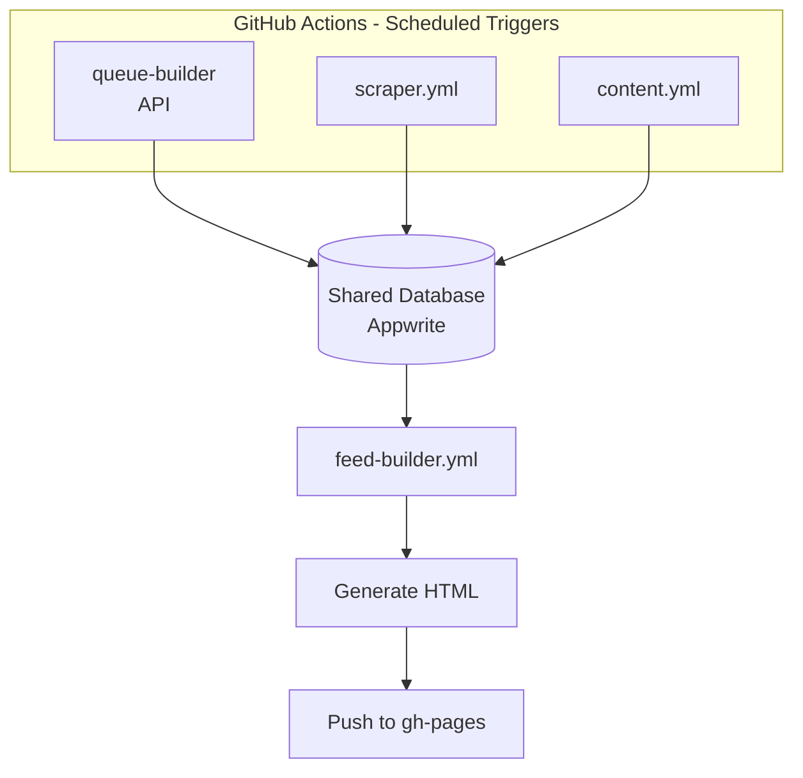
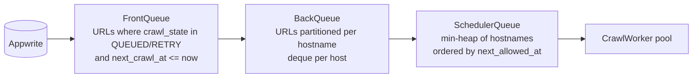
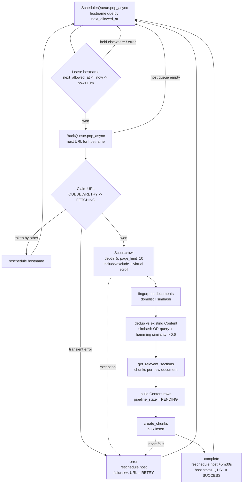
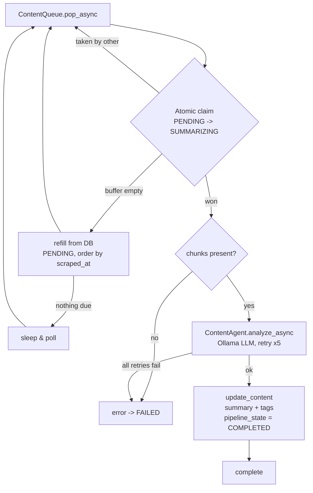
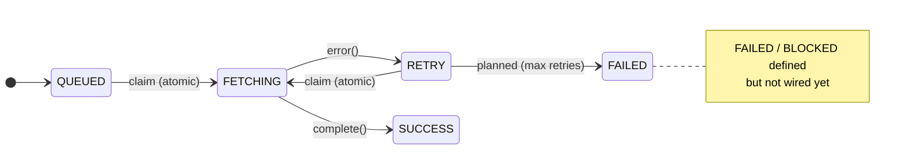
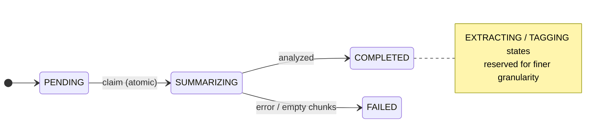

# FeedX
The idea is building feedline for me based on the sources I like. A recurring feed and timeline always prepared for me so that anytime I want to read something they are always ready

Built on top of
1. [Scout](https://github.com/ArnabChatterjee20k/Scout)  
2. [Domdistill](https://github.com/ArnabChatterjee20k/domdistill)
Some of the frameworks I built recently to solve this problem efficiently

# Working

Github actions trigger the jobs automatically or using the cli to run this manually



TODO: Make sure to guard via auth so that randomly requests can't get created
At every run the queues are formed
API -> just for content ingestion and data output
CLI -> to replicate the scheduler environment locally

# Pipeline Flow

The system is a chain of stages that hand work to each other through the shared
Appwrite database. Ingestion writes `URL` rows, the **crawl pipeline** turns URLs
into raw `Content`, and the **content pipeline** enriches that content into a
feed-ready form. Each stage is a pool of self-sufficient workers; every hand-off
is guarded by a DB-level atomic claim so multiple workers/processes never touch
the same row.

## Queue construction

At the start of a crawl run the in-memory queues are (re)built from the DB:



The `ContentQueue` is built independently from `Content` rows in `PENDING` state
(ordered by `scraped_at`) and lazily refills itself when it drains.

## Crawl pipeline (`workers/crawl_worker.py`)

One iteration of a crawl worker: pick a due hostname, lease it, claim a URL,
crawl it, dedup, and persist new content.



## Content pipeline (`workers/content_worker.py`)

One iteration of a content worker: atomically claim a pending item, run it
through the LLM agent, and write back the summary/tags.



## State machines

Rows advance through explicit states; the atomic claims are the guarded
transitions (bold arrows below).





## Concurrency — atomic claims

Every stage-to-stage hand-off is a conditional DB update; exactly one
worker/process can win, which makes the pipeline safe to run with multiple
workers and across parallel GitHub Action runners.

| Level | Where | Transition (only if precondition holds) |
|-------|-------|------------------------------------------|
| Hostname | `CrawlWorker._lease_hostname` | `next_allowed_at <= now` → `now + 10m` |
| URL | `CrawlWorker._claim` | `crawl_state in (QUEUED, RETRY)` → `FETCHING` |
| Content | `ContentQueue._claim` | `pipeline_state == PENDING` → `SUMMARIZING` |

> Known gap: a row claimed by a process that then crashes is never retried
> (stale `FETCHING` / `SUMMARIZING`). A `claimed_at` timestamp + a reaper that
> resets stale claims is a planned follow-up (see `plan.md`).

# Feed builder algo

Rank every candidate post into a **single number** and take the top N.

- **Inputs** (per post): `tags`, `scraped_at`, `last_shown_at`, `last_seen_at`
- **Output**: one score per post → sort → feed
- **Modifier**: my interactions change the weight of *tags*, which is what
  connects my behaviour to a post I've never seen (we share tags, not history).

The score is built from four parts, on **two separate axes**:

| axis | parts | driven by |
|------|-------|-----------|
| interest (tags) | continuity, relevance, novelty | interaction history |
| time (timestamps) | freshness | `scraped_at`, `last_shown_at`, `last_seen_at` |

## 1. Interest profile — interactions → per-tag weight

Each interaction has a type weight, decayed by its age:

| signal | weight |
|--------|--------|
| impression | 0.1 |
| open | 1.0 |
| read | 2.0 |
| like / bookmark / share | 3.0 |
| **hide** | **−3.0** |

**Half-life decay**: a signal should be worth half after `H` days. "Multiply by
the same factor each day" forces exponential decay: `factor = r^age`, and picking
`r` by half-life gives `r^H = 0.5 → r = 0.5^(1/H)`, so:

```
weight(tag) = Σ over interactions on that tag of [ type_weight × 0.5^(age / H) ]
```

Run the **same sum at two half-lives** to get two lenses (then normalise each to
`[0, 1]` by dividing by the max so the parts are comparable):

- `H = 2`  → short memory → only *this week* survives → **continuity** ("now")
- `H = 14` → long memory → weeks still count → **relevance** ("core")

Bigger `H` = slower decay = old signals keep contributing — that single knob is
the entire difference between the two profiles. A tag whose long weight goes
**net negative** (from `hide`) is marked **suppressed**.

## 2. Per-post scores

A post has several tags, so collapse them to one number (operator chosen by
meaning):

```
continuity = MAX over tags of  recent_weight[tag]   # one hot tag = on the thread
relevance  = MEAN over tags of long_weight[tag]     # overall alignment with core
novelty    = 1 − relevance                          # high when tags are non-core
freshness  = age_factor × shown_factor × suppressed_penalty
```

Freshness is a **gate** (a product of `[0,1]` factors), separate from interest:

- `age_factor  = 0.5^(age_days / 10)` — the post itself ages (10-day half-life)
- `shown_factor` — cooldown from `last_shown_at`: `1.0` if never shown, else
  `clamp(days_since_shown / 3, 0.15, 1.0)` (recently shown → suppressed, then
  ramps back so an unseen post can resurface)
- `suppressed_penalty` = `0.1` if the post carries a hidden tag, else `1.0`
- `last_seen_at` set (already read) → **excluded before scoring** (a hard filter,
  not a small number)

## 3. Final score

Interest parts are **alternative reasons → weighted sum**; freshness is a
**gate → multiply** (already-seen/stale must zero it out):

```
score = (0.5 · continuity + 0.2 · relevance + 0.3 · novelty) × freshness
```

The `0.5 / 0.2 / 0.3` split is the "50% keep my threads, 20% core, 30% explore"
budget. (A stricter variant fills 50/20/30 of the *slots* per bucket to guarantee
the composition; both use the same per-post numbers above.)

## Worked example

Profile after decay + normalise (suppressed: `crypto`):

| tag | recent (H=2) | long (H=14) |
|-----|--------------|-------------|
| rust | 1.00 | 0.93 |
| databases | 0.44 | 1.00 |
| python | 0.22 | 0.62 |

Candidate posts:

| post | tags | scraped | last_shown | last_seen |
|------|------|---------|------------|-----------|
| P1 | rust, async | 1d | never | — |
| P2 | databases, sql | 2d | never | — |
| P3 | databases, python | 3d | 1d ago | — |
| P4 | machine-learning, python | 1d | never | — |
| P5 | crypto, web | 1d | never | — |
| P6 | rust, embedded | 4d | — | 2d ago |

Scoring — `score = (0.5·cont + 0.2·rel + 0.3·nov) × F`:

| post | cont | rel | nov | F | **score** |
|------|------|-----|-----|-----|-----------|
| P1 | 1.00 | 0.47 | 0.53 | 0.93 | **0.70** |
| P2 | 0.44 | 0.50 | 0.50 | 0.87 | **0.41** |
| P4 | 0.22 | 0.31 | 0.69 | 0.93 | **0.35** |
| P3 | 0.44 | 0.81 | 0.19 | 0.27 | **0.12** |
| P5 | 0.00 | 0.00 | 1.00 | 0.09 | **0.03** |
| P6 | — | — | — | excluded | — |

Worked out for P1: `(0.5·1.00 + 0.2·0.47 + 0.3·0.53) × 0.93 = 0.753 × 0.93 = 0.70`.

**Ranked feed → P1, P2, P4, P3, P5.** Reading the result:

- **P1** wins — my hot `rust` thread, fresh, never shown (continuity carries it).
- **P3** has the best `relevance` (0.81, pure core) but I showed it *yesterday*,
  so `F = 0.27` sinks it — it'll climb back in a couple of days.
- **P4** (machine-learning) rides in on `novelty` despite low interest — the
  explore budget doing its job.
- **P5** is crushed: `crypto` is suppressed and penalises freshness to 0.09.
- **P6** never appears — already read (`last_seen_at` set), filtered in pooling.
