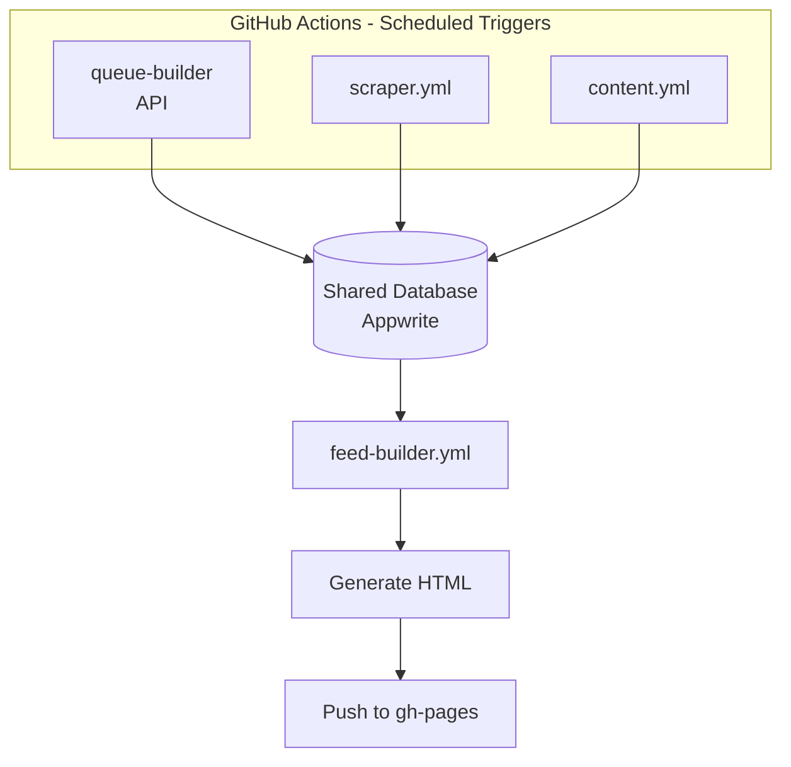
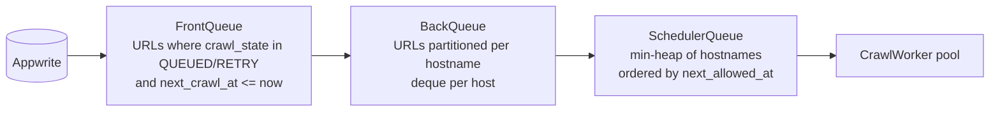
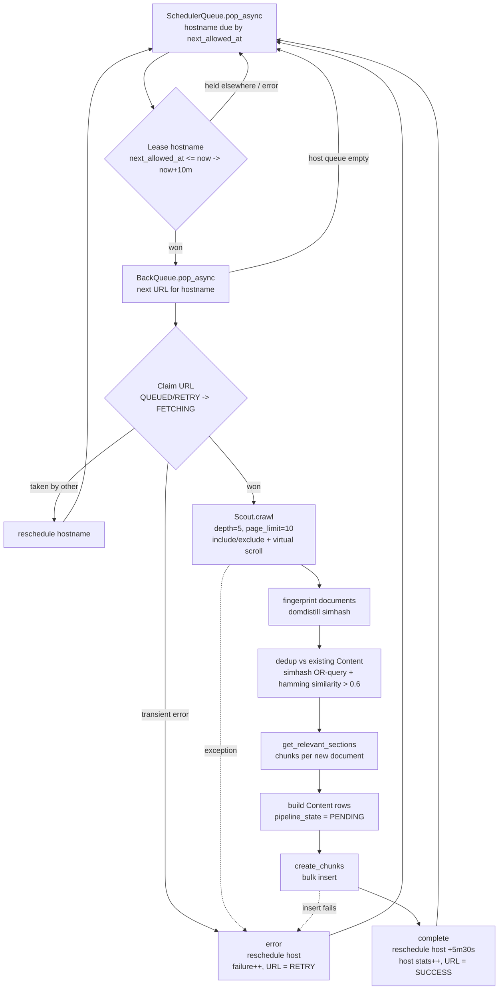
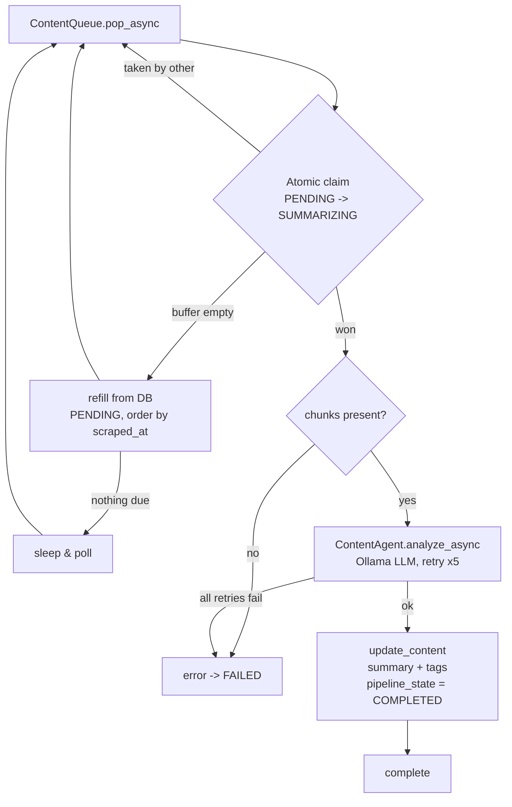
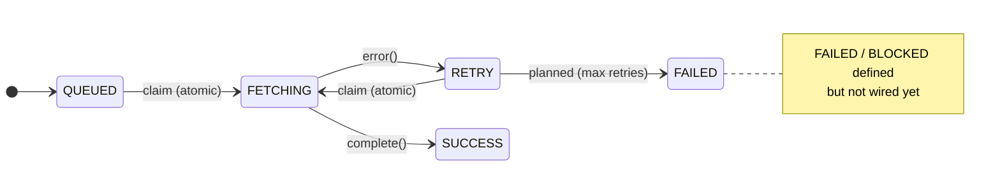
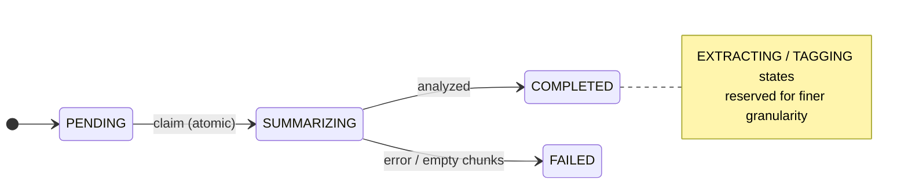

# FeedX
The idea is building feedline for me based on the sources I like. A recurring feed and timeline always prepared for me so that anytime I want to read something they are always ready

Built on top of
1. [Scout](https://github.com/ArnabChatterjee20k/Scout)  
2. [Domdistill](https://github.com/ArnabChatterjee20k/domdistill)
Some of the frameworks I built recently to solve this problem efficiently

# Working

Github actions trigger the jobs automatically or using the cli to run this manually

TODO: Make sure to guard via auth so that randomly requests can't get created
At every run the queues are formed
API -> just for content ingestion and data output
CLI -> to replicate the scheduler environment locally

# Pipeline Flow

The system is a chain of stages that hand work to each other through the shared
Appwrite database. Ingestion writes `URL` rows, the **crawl pipeline** turns URLs
into raw `Content`, and the **content pipeline** enriches that content into a
feed-ready form. Each stage is a pool of self-sufficient workers; every hand-off
is guarded by a DB-level atomic claim so multiple workers/processes never touch
the same row.

## Queue construction

At the start of a crawl run the in-memory queues are (re)built from the DB:

The `ContentQueue` is built independently from `Content` rows in `PENDING` state
(ordered by `scraped_at`) and lazily refills itself when it drains.

## Crawl pipeline (`workers/crawl_worker.py`)

One iteration of a crawl worker: pick a due hostname, lease it, claim a URL,
crawl it, dedup, and persist new content.

## Content pipeline (`workers/content_worker.py`)

One iteration of a content worker: atomically claim a pending item, run it
through the LLM agent, and write back the summary/tags.

## State machines

Rows advance through explicit states; the atomic claims are the guarded
transitions (bold arrows below).

## Concurrency — atomic claims

Every stage-to-stage hand-off is a conditional DB update; exactly one
worker/process can win, which makes the pipeline safe to run with multiple
workers and across parallel GitHub Action runners.

| Level | Where | Transition (only if precondition holds) |
|-------|-------|------------------------------------------|
| Hostname | `CrawlWorker._lease_hostname` | `next_allowed_at <= now` → `now + 10m` |
| URL | `CrawlWorker._claim` | `crawl_state in (QUEUED, RETRY)` → `FETCHING` |
| Content | `ContentQueue._claim` | `pipeline_state == PENDING` → `SUMMARIZING` |

> Known gap: a row claimed by a process that then crashes is never retried
> (stale `FETCHING` / `SUMMARIZING`). A `claimed_at` timestamp + a reaper that
> resets stale claims is a planned follow-up (see `plan.md`).